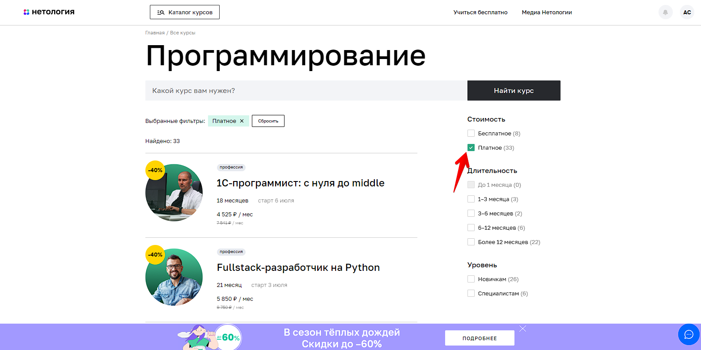
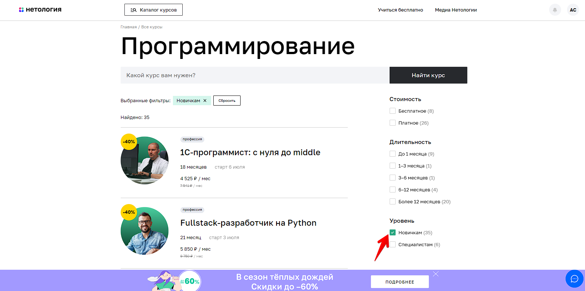

# Тестирование возможности записаться на обучение профессии «Тестировщик ПО»

---

### Содержание

1. Перечень автоматизируемых сценариев
2. Перечень используемых инструментов с обоснованием выбора
3. Перечень необходимых разрешений, данных и доступов
4. Перечень и описание возможных рисков при автоматизации
5. Перечень необходимых специалистов для автоматизации
6. Интервальная оценка с учётом рисков в часах

---

## 1. Перечень автоматизируемых сценариев
### 1.1 Сценарии перехода с главной страницы сайта Нетология на страницу профессии

**_Сценарий №1:_**
1. Перейти на страницу [Нетологии](https://netology.ru/) (https://netology.ru/)
2. В блоке "Направления обучения" выбрать "Программирование" (рис.1)

_Рис. 1_
3. Прокрутить страницу до профессии "Тестировщик ПО"
4. Нажать на карточку профессии "Тестировщик ПО" (рис.2)

_Рис. 2_

**_Сценарий №2:_**
1. Перейти на страницу [Нетологии](https://netology.ru/) (https://netology.ru/)
2. В блоке "Направления обучения" выбрать "Программирование" (рис.1)
3. Написать в поисковой строке "тестировщик" 
4. Кликнуть "Тестировщик ПО" (рис.3)

_Рис. 3_

**_Сценарий №3:_**
1. Перейти на страницу [Нетологии](https://netology.ru/) (https://netology.ru/)
2. В блоке "Направления обучения" выбрать "Программирование" (рис.1)
3. Написать в поисковой строке "тестировщик"
4. Нажать кнопку "Найти курс"
5. Прокрутить страницу до профессии "Тестировщик ПО"
6. Нажать на карточку профессии "Тестировщик ПО" (рис.2)

**_Сценарий №4:_**
1. Перейти на страницу [Нетологии](https://netology.ru/) (https://netology.ru/)
2. В блоке "Направления обучения" выбрать "Полный каталог" (рис.4)

_Рис. 4_
3. Написать в поисковой строке "тестировщик"
4. Кликнуть "Тестировщик ПО" (рис.3)

**_Сценарий №5:_**
1. Перейти на страницу [Нетологии](https://netology.ru/) (https://netology.ru/)
2. В блоке "Направления обучения" выбрать "Полный каталог" (рис.4)
3. Прокрутить страницу до профессии "Тестировщик ПО"
4. Нажать на карточку профессии "Тестировщик ПО" (рис.2)

**_Сценарий №6:_**
1. Перейти на страницу [Нетологии](https://netology.ru/) (https://netology.ru/)
2. В блоке "Направления обучения" выбрать "Полный каталог" (рис.4)
3. Выбрать плашку "Программирование" (рис.5)

_Рис. 5_
4. Прокрутить страницу до профессии "Тестировщик ПО"
5. Нажать на карточку профессии "Тестировщик ПО" (рис.2)

**_Сценарий №7:_**
1. Перейти на страницу [Нетологии](https://netology.ru/) (https://netology.ru/)
2. В блоке "Направления обучения" выбрать "Полный каталог" (рис.4)
3. Выбрать плашку "Программирование" (рис.5)
4. Написать в поисковой строке "тестировщик"
5. Кликнуть "Тестировщик ПО" (рис.3)

**_Сценарий №8:_**
1. Перейти на страницу [Нетологии](https://netology.ru/) (https://netology.ru/)
2. В блоке "Направления обучения" выбрать "Полный каталог" (рис.4)
3. Написать в поисковой строке "тестировщик"
4. Нажать кнопку "Найти курс"
5. Прокрутить страницу до профессии "Тестировщик ПО"
6. Нажать на карточку профессии "Тестировщик ПО" (рис.2)

**_Сценарий №9:_**
1. Перейти на страницу [Нетологии](https://netology.ru/) (https://netology.ru/)
2. В блоке "Направления обучения" выбрать "Полный каталог" (рис.4)
3. Выбрать плашку "Программирование" (рис.5)
4. Написать в поисковой строке "тестировщик"
5. Нажать кнопку "Найти курс"
6. Прокрутить страницу до профессии "Тестировщик ПО"
7. Нажать на карточку профессии "Тестировщик ПО" (рис.2)

**_Сценарий №10:_**
1. Перейти на страницу [Нетологии](https://netology.ru/) (https://netology.ru/)
2. Нажать кнопку "Каталог курсов" (Рис.6)

_Рис.6_
3. Выбрать плашку "Программирование"
4. Написать в поисковой строке "тестировщик"
5. Кликнуть "Тестировщик ПО" (рис.3)

**_Сценарий №11:_**
1. Перейти на страницу [Нетологии](https://netology.ru/) (https://netology.ru/)
2. Нажать кнопку "Каталог курсов" (Рис.6)
3. Выбрать плашку "Программирование"
4. Написать в поисковой строке "тестировщик"
5. Нажать кнопку "Найти курс"
6. Прокрутить страницу до профессии "Тестировщик ПО"
7. Нажать на карточку профессии "Тестировщик ПО" (рис.2)

**_Сценарий №12:_**
1. Перейти на страницу [Нетологии](https://netology.ru/) (https://netology.ru/)
2. Нажать кнопку "Каталог курсов" (Рис.6)
3. Выбрать плашку "Программирование" (рис.5)
4. Прокрутить страницу до профессии "Тестировщик ПО"
5. Нажать на карточку профессии "Тестировщик ПО" (рис.2)

**_Сценарий №13:_**
1. Перейти на страницу [Нетологии](https://netology.ru/) (https://netology.ru/)
2. Нажать кнопку "Каталог курсов" (Рис.6)
3. Написать в поисковой строке "тестировщик"
4. Нажать кнопку "Найти курс"
5. Прокрутить страницу до профессии "Тестировщик ПО"
6. Нажать на карточку профессии "Тестировщик ПО" (рис.2)

**_Сценарий №14:_**
1. Перейти на страницу [Нетологии](https://netology.ru/) (https://netology.ru/)
2. Нажать кнопку "Каталог курсов" (Рис.6)
3. Написать в поисковой строке "тестировщик"
4. Кликнуть "Тестировщик ПО" (рис.3)

**_Сценарий №15:_**
1. Перейти на страницу [Нетологии](https://netology.ru/) (https://netology.ru/)
2. Нажать кнопку "Каталог курсов" (Рис.6) 
3. Выбрать плашку "Программирование" (рис.5)
4. Поставить галочку в чек-бокс "Платное" (рис.7)

_Рис.7_
5. Прокрутить страницу до профессии "Тестировщик ПО"
6. Нажать на карточку профессии "Тестировщик ПО" (рис.2)

**_Сценарий №16:_**
1. Перейти на страницу [Нетологии](https://netology.ru/) (https://netology.ru/)
2. Нажать кнопку "Каталог курсов" (Рис.6)
3. Выбрать плашку "Программирование" (рис.5)
4. Поставить галочку в чек-бокс "6-12 месяцев" (рис.8)

_Рис.8_
5. Прокрутить страницу до профессии "Тестировщик ПО"
6. Нажать на карточку профессии "Тестировщик ПО" (рис.2)

**_Сценарий №17:_**
1. Перейти на страницу [Нетологии](https://netology.ru/) (https://netology.ru/)
2. Нажать кнопку "Каталог курсов" (Рис.6)
3. Выбрать плашку "Программирование" (рис.5)
4. Поставить галочку в чек-бокс "Новичкам" (рис.9)

_Рис.9_
5. Прокрутить страницу до профессии "Тестировщик ПО"
6. Нажать на карточку профессии "Тестировщик ПО" (рис.2)

**_Сценарий №18:_**
1. Перейти на страницу [Нетологии](https://netology.ru/) (https://netology.ru/)
2. В блоке "Направления обучения" выбрать "Полный каталог" (рис.4)
3. Поставить галочку в чек-бокс "Платное" (рис.7)
4. Прокрутить страницу до профессии "Тестировщик ПО"
5. Нажать на карточку профессии "Тестировщик ПО" (рис.2)

**_Сценарий №19:_**
1. Перейти на страницу [Нетологии](https://netology.ru/) (https://netology.ru/)
2. В блоке "Направления обучения" выбрать "Полный каталог" (рис.4)
3. Поставить галочку в чек-бокс "6-12 месяцев" (рис.8)
4. Прокрутить страницу до профессии "Тестировщик ПО"
5. Нажать на карточку профессии "Тестировщик ПО" (рис.2)
   
**_Сценарий №20:_**
1. Перейти на страницу [Нетологии](https://netology.ru/) (https://netology.ru/)
2. В блоке "Направления обучения" выбрать "Полный каталог" (рис.4)
3. Поставить галочку в чек-бокс "Новичкам" (рис.9)
4. Прокрутить страницу до профессии "Тестировщик ПО"
5. Нажать на карточку профессии "Тестировщик ПО" (рис.2)

**_Сценарий №21:_**
1. Перейти на страницу [Нетологии](https://netology.ru/) (https://netology.ru/)
2. Прокрутить страницу до подвала
3. Выбрать "Программирование" (рис.10)

_Рис.10_
4. Написать в поисковой строке "тестировщик"
5. Кликнуть "Тестировщик ПО" (рис.3)

**_Сценарий №22:_**
1. Перейти на страницу [Нетологии](https://netology.ru/) (https://netology.ru/)
2. Прокрутить страницу до подвала
3. Выбрать "Программирование" (рис.10)
4. Написать в поисковой строке "тестировщик"
5. Нажать кнопку "Найти курс"
6. Прокрутить страницу до профессии "Тестировщик ПО"
7. Нажать на карточку профессии "Тестировщик ПО" (рис.2)

**_Сценарий №23:_**
1. Перейти на страницу [Нетологии](https://netology.ru/) (https://netology.ru/)
2. Прокрутить страницу до подвала
3. Выбрать "Программирование" (рис.10)
4. Прокрутить страницу до профессии "Тестировщик ПО"
5. Нажать на карточку профессии "Тестировщик ПО" (рис.2)

**_Сценарий №24:_**
1. Перейти на страницу [Нетологии](https://netology.ru/) (https://netology.ru/)
2. Прокрутить страницу до подвала
3. Выбрать "Популярные курсы" (рис.11)

_Рис.11_
4. Прокрутить страницу до профессии "Тестировщик ПО"
5. Нажать на карточку профессии "Тестировщик ПО" (рис.2)

**_Сценарий №25:_**
1. Перейти на страницу [Нетологии](https://netology.ru/) (https://netology.ru/)
2. Прокрутить страницу до подвала
3. Выбрать "Популярные курсы" (рис.11)
4. Написать в поисковой строке "тестировщик"
5. Нажать кнопку "Найти курс"
6. Прокрутить страницу до профессии "Тестировщик ПО"
7. Нажать на карточку профессии "Тестировщик ПО" (рис.2)

**_Сценарий №26:_**
1. Перейти на страницу [Нетологии](https://netology.ru/) (https://netology.ru/)
2. Прокрутить страницу до подвала
3. Выбрать "Популярные курсы" (рис.11)
4. Написать в поисковой строке "тестировщик"
5. Кликнуть "Тестировщик ПО" (рис.3)

**_Сценарий №27:_**
1. Перейти на страницу [Нетологии](https://netology.ru/) (https://netology.ru/)
2. Прокрутить страницу до подвала
3. Выбрать "Популярные курсы" (рис.11)
4. Поставить галочку в чек-бокс "Платное" (рис.7)
5. Прокрутить страницу до профессии "Тестировщик ПО"
6. Нажать на карточку профессии "Тестировщик ПО" (рис.2)

**_Сценарий №28:_**
1. Перейти на страницу [Нетологии](https://netology.ru/) (https://netology.ru/)
2. Прокрутить страницу до подвала
3. Выбрать "Популярные курсы" (рис.11)
4. Поставить галочку в чек-бокс "6-12 месяцев" (рис.8)
5. Прокрутить страницу до профессии "Тестировщик ПО"
6. Нажать на карточку профессии "Тестировщик ПО" (рис.2)

**_Сценарий №29:_**
1. Перейти на страницу [Нетологии](https://netology.ru/) (https://netology.ru/)
2. Прокрутить страницу до подвала
3. Выбрать "Популярные курсы" (рис.11)
4. Поставить галочку в чек-бокс "Новичкам" (рис.9)
5. Прокрутить страницу до профессии "Тестировщик ПО"
6. Нажать на карточку профессии "Тестировщик ПО" (рис.2)

**Ожидаемый результат всех сценариев: открыта страница курса ["Тестировщик"](https://netology.ru/programs/qa).**

### 1.2 Сценарии перехода к форме записи на курс на странице курса "Тестировщик ПО"

**_Сценарий №1:_**
1. Открыта страница курса ["Тестировщик"](https://netology.ru/programs/qa)(https://netology.ru/programs/qa)
2. Нажать на кнопку "Записаться" (рис.12)

_Рис.12_

**_Сценарий №2:_**
1. Открыта страница курса ["Тестировщик"](https://netology.ru/programs/qa)(https://netology.ru/programs/qa)
2. Пролистать страницу вниз
3. В появившейся сверху всплывающей строке нажать кнопку "Записаться" (рис.13)

_Рис.13_

**Ожидаемый результат сценариев №1 и №2: прокрутка страницы к форме записи на курс.**

**_Сценарий №3:_**
1. Открыта страница курса ["Тестировщик"](https://netology.ru/programs/qa)(https://netology.ru/programs/qa)
2. Пролистать страницу вниз до формы "Запишитесь на курс" (рис.14)

_Рис.14_

### 1.3 Сценарии заполнения и отправки формы регистрации на курс

#### 1.3.1 Заполнение полей зарегистрированным пользователем

**_Сценарий Registered User:_**
1. На главной странице [Нетологии](https://netology.ru/) нажать кнопку "Войти"
2. Авторизоваться с данными зарегистрированного пользователя
3. На странице курса ["Тестировщик"](https://netology.ru/programs/qa) в форме записи на курс поля "Имя" и "Номер телефона" автозаполнены данными, которые указывались при регистрации
4. Кликнуть по кнопке "Записаться"

**Ожидаемый результат: успешная запись на курс**

#### 1.3.2 Заполнение полей незарегистрированным пользователем

**_~Сценарий Happy Path:~_**
1. Заполнить поле "Имя" буквами кириллицы или латиницы, не менее двух букв
2. Заполнить поле "Номер телефона" по шаблону:
* в формате +7 (999) 999-99-99
* от 9 до 14 цифр
3. Заполнить поле "Электронная почта" по шаблону email@example.com:
* поле должно содержать:
    * значок «собака» (@)
    * точку (.)
* поле не должно содержать кириллических букв
* в поле должно быть верное наименование почтового домена (yandex.ru, mail.ru, gmail.com и т. д.)
4. Нажать на кнопку "Записаться"

**Ожидаемый результат: успешная запись на курс**

~**_Сценарии Empty Field:_**~

**_Сценарий №1:_**
1. Не заполнять поле "Имя"
2. Заполнить поле "Номер телефона" валидным значением 
3. Заполнить поле "Электронная почта" валидным значением
4. Нажать на кнопку "Записаться"

**_Сценарий №2:_**
1. Заполнить поле "Имя" валидным значением
2. Не заполнять поле "Номер телефона"
3. Заполнить поле "Электронная почта" валидным значением
4. Нажать на кнопку "Записаться"

**_Сценарий №3:_**
1. Заполнить поле "Имя" валидным значением
2. Заполнить поле "Номер телефона" валидным значением
3. Не заполнять поле "Электронная почта"
4. Нажать на кнопку "Записаться"

**Ожидаемый результат всех сценариев Empty Field: запись на курс не происходит**

**~_Сценарии Sad Path:_~**

**_Сценарий №1:_**
1. Заполнить поле "Имя" одной буквой
2. Заполнить поле "Номер телефона" валидным значением 
3. Заполнить поле "Электронная почта" валидным значением 
4. Нажать на кнопку "Записаться"

**_Сценарий №2:_**
1. Заполнить поле "Имя" цифрами
2. Заполнить поле "Номер телефона" валидным значением
3. Заполнить поле "Электронная почта" валидным значением
4. Нажать на кнопку "Записаться"

**_Сценарий №3:_**
1. Заполнить поле "Имя" символами/знаками препинания
2. Заполнить поле "Номер телефона" валидным значением
3. Заполнить поле "Электронная почта" валидным значением
4. Нажать на кнопку "Записаться"

**_Сценарий №4:_**
1. Заполнить поле "Имя" валидным значением
2. Заполнить поле "Номер телефона" менее 9 цифр
3. Заполнить поле "Электронная почта" валидным значением
4. Нажать на кнопку "Записаться"

**_Сценарий №5:_**
1. Заполнить поле "Имя" валидным значением
2. Заполнить поле "Номер телефона" более 14 цифр
3. Заполнить поле "Электронная почта" валидным значением
4. Нажать на кнопку "Записаться"

**_Сценарий №6:_**
1. Заполнить поле "Имя" валидным значением
2. Заполнить поле "Номер телефона" буквами кириллицы или латиницы
3. Заполнить поле "Электронная почта" валидным значением
4. Нажать на кнопку "Записаться"

**_Сценарий №7:_**
1. Заполнить поле "Имя" валидным значением
2. Заполнить поле "Номер телефона" отличными от шаблона символами (например, %/.)
3. Заполнить поле "Электронная почта" валидным значением
4. Нажать на кнопку "Записаться"

**_Сценарий №8:_**
1. Заполнить поле "Имя" валидным значением
2. Заполнить поле "Номер телефона" валидным значением
3. Заполнить поле "Электронная почта" буквами кириллицы
4. Нажать на кнопку "Записаться"

**_Сценарий №9:_**
1. Заполнить поле "Имя" валидным значением
2. Заполнить поле "Номер телефона" валидным значением
3. Заполнить поле "Электронная почта" буквами латиницы
* без значка собачки (@)
4. Нажать на кнопку "Записаться"

**_Сценарий №9:_**
1. Заполнить поле "Имя" валидным значением
2. Заполнить поле "Номер телефона" валидным значением
3. Заполнить поле "Электронная почта" буквами латиницы
* без точки (.)
4. Нажать на кнопку "Записаться"
 
**Ожидаемый результат всех сценариев Sad Path: запись на курс не происходит**

## 2. Перечень используемых инструментов с обоснованием выбора

1. *IntelliJ IDEA 2022.3.2 (Community Edition)* — среда разработки, поддержка многих языков программирования (Java, JavaScript, Python),с поддержкой всех последних технологий и фреймворков. Версия Community Edition бесплатная. 
2. *Java 11* — язык для написания автотестов, имеет набор готового ПО для разработки и запуска приложений. 
3. *Gradle* — понадобится для сборки проекта, для управления подключенными зависимостями, а так же для генерации отчётов о тестировании.
4. *JUnit 5* — необходим для написания и запуска тестов. Не требует контроля пользователя во время исполнения тестов, может запускать одновременно несколько тестов, сообщает обо всех ошибках в ходе тестирования, предоставляет готовый набор методов для сравнения ожидаемого и фактического результатов.
5. *Docker* — это программное обеспечение, которое дает возможность на определенном участке памяти изолированно установить необходимую ОС (операционную систему), версию Java, настроить переменные окружения, установить различные зависимости и дать доступ только при определенных условиях.
6. *Selenide* — фреймворк, необходимый, для тестирования GUI. Помогает делать стабильные тесты, решая почти все проблемы с таймаутами, автоматически управляет браузером и делает скриншоты если тест упал.
7. *Lombok* — основанная на аннотациях библиотека Java, позволяющая сократить шаблонный код, уменьшает трудозатраты и время на разработку и обеспечивает некоторую дополнительную функциональность.
8. *Faker* — библиотека, необходимая для генерации тестовых данных.
9. *Rest Assured* — java-библиотека для тестирования REST API, позволяет автоматизировать тестирование get и post запросов.
10. *Allure* — фреймворк для создания отчетов о тестировании, наглядного отображения прохождения тестов и ошибок. Обладает более широким представление отчетов об проводимых тестах, чем Gradle.
11. *Git и GitHub* — для ведения репозитория по проектам. Git достаточно прост и удобен для управления исходным кодом, очень распространенная система контроля версий, поэтому достаточно хорошо взаимодействует с различными ОС. GitHub специализированный веб-сервис с удобным интерфейсом, интегрирован с Git.
12. *AppVeyor* — распределённый веб-сервис непрерывной интеграции, предназначенный для сборки и тестирования программного обеспечения расположенного на GitHub и других сервисах хранения исходного кода (включая GitLab и Bitbucket), использующий виртуальные машины Microsoft Windows и Ubuntu. Этот сервис удобен тем что он имеет бесплатный базовый тариф, может осуществлять сборку как под управлением Linux, так и под Windows, а если необходимо то под несколькими сразу.

## 3. Перечень необходимых разрешений, данных и доступов

1. Если тестирование реализует не сама Нетология, то необходимо письменное разрешение на его проведение от владельца сайта Нетологии
2. Доступ к API и БД для проверки результатов выполнения тестов
3. Техническая документация, для понимания валидных и невалидных данных и др. требований 
4. API для отправки GET и POST запросов на сервер

## 4. Перечень и описание возможных рисков при автоматизации

1. Отсутствие технической документации
2. Не значительное изменение реализации веб-элементов на странице, могут привести к падению ранее написанных авто-тестов
3. Ложные срабатывания по отправке форм, что в свою очередь может увеличить нагрузку по обработке данных

## 5. Перечень необходимых специалистов для автоматизации
1. QA-инженер не ниже Middle
2. QA-инженер Junior

## 6. Интервальная оценка с учётом рисков в часах
Время реализации проекта: 12 часов
